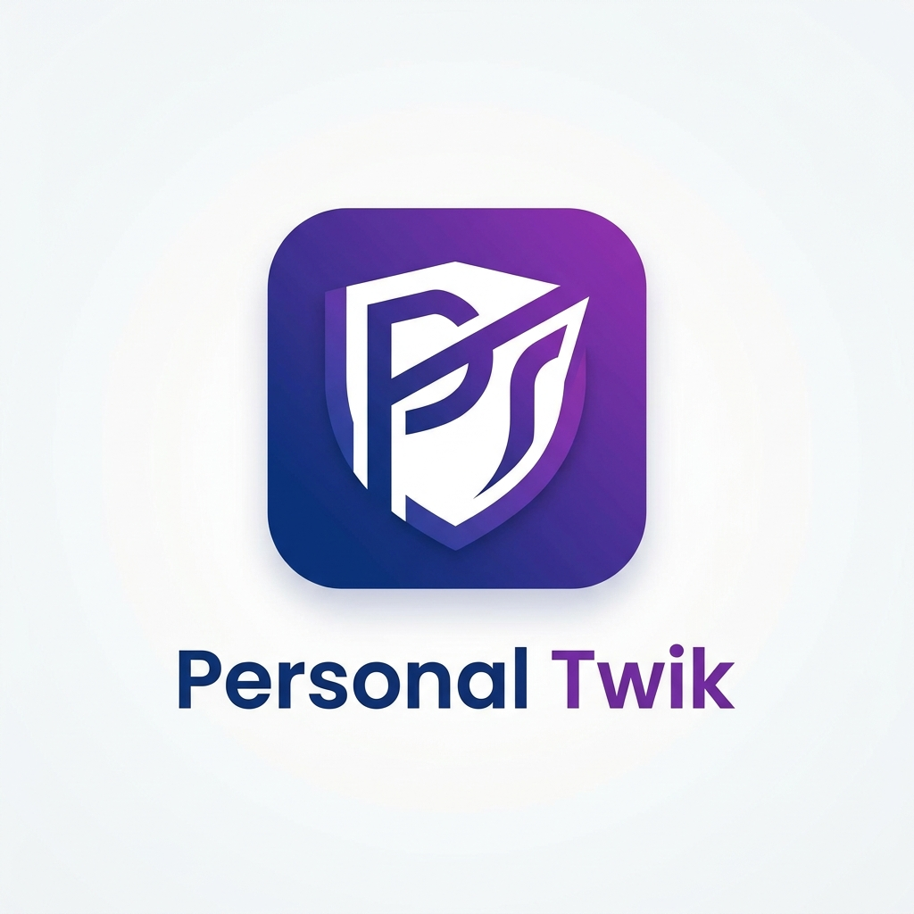

# Personal Assistant

**Personal Assistant** is a lightweight browser extension that removes distracting feeds from social media.

## Features

- **Master switch** — instantly pause or resume all blocking with one toggle at the top of the popup.
- **Facebook** — block Reels, block the main News Feed.
- **Instagram** — block Reels, block the Explore page.
- **YouTube** — block Shorts, block the suggested/home feed.

Blocking is done via lightweight CSS injection (no polling, no heavy DOM scanning), and rules re-apply automatically when a site's single-page app navigates without a full reload.

## Installation

1. Clone or download this repository.
2. Open your browser's extensions page:
   - Chrome: `chrome://extensions/`
   - Edge: `edge://extensions/`
3. Enable **Developer mode**.
4. Click **Load unpacked** and select this folder.
5. The "Personal Assistant" icon will appear in your toolbar.

## Usage

Click the toolbar icon and toggle any rule on or off — changes apply immediately to all open tabs. Use the switch next to the extension name to pause everything at once.

---
*Stay focused, stay productive.*
